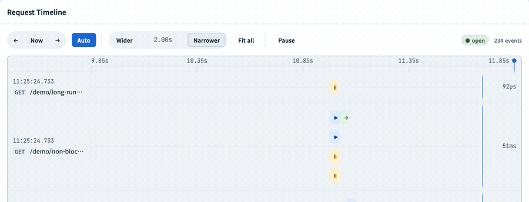
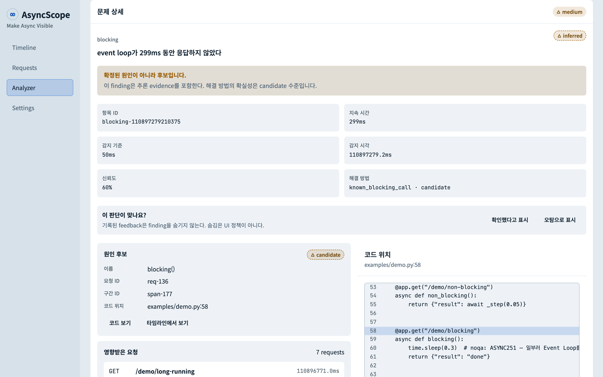

[한국어](README.md)

> Don't just write async.
>
>
> **See it. Understand it. Trust it.**
>


## Overview

**AsyncScope** is an open-source DevTool that **visualizes the asynchronous execution flow** of FastAPI/asyncio-based applications, helping developers intuitively understand `async/await`.

Today, most developers write code like this without fully understanding FastAPI's asynchronous behavior:

```python
@app.get("/users")
async def get_users():
    users = await service.get_users()
    return users
```

But in reality, it's hard to know:

- When the Event Loop runs another request
- At what point a Coroutine is suspended
- What blocks the Event Loop
- How a sync function affects async code

AsyncScope visualizes this execution process as a **timeline and animation**.

<picture>
  <source media="(prefers-color-scheme: dark)" srcset="docs/assets/timeline-dark.gif">
  
</picture>

---

# Quick start

Requires CPython 3.12+ (AsyncScope uses `sys.monitoring`).

```bash
pip install asyncscope-tracer
# or
uv add asyncscope-tracer
```

> The distribution is `asyncscope-tracer`; the import is `asyncscope`. An unrelated
> package already owns the name `asyncscope` on PyPI, so only the distribution name differs.

Wrap your ASGI app and hand the result to uvicorn.

```python
# main.py
from fastapi import FastAPI
from asyncscope import AsyncScope

app = FastAPI()
traced = AsyncScope(app).install()   # the ASGI app to give uvicorn
```

```bash
uvicorn main:traced --reload --port 8000
```

> Point uvicorn at `main:traced`, not `main:app` — the dashboard (`/__asyncscope__/*`)
> is only reachable through that wrapper.

Open **http://localhost:8000/__asyncscope__/**. The dashboard ships inside the wheel —
no separate process and no internet connection required.

No changes to your existing code are needed — just the two lines above. Done debugging?
Remove those two lines and you're back to your original app (this is a dev-only tool).

---

# Problem

FastAPI is easy to learn, but **its asynchronous execution model is invisible.**

Most developers understand it only at the level of "adding async makes it faster," "await just waits," or "calling one sync function is probably fine."

In reality,

```python
await asyncio.sleep(1)
```

and

```python
time.sleep(1)
```

behave completely differently from the Event Loop's perspective. But current dev tools don't explain this visually.

AsyncScope finds the window where the Event Loop stalled and points at the line of code behind it.

<picture>
  <source media="(prefers-color-scheme: dark)" srcset="docs/assets/analyzer-dark.png">
  
</picture>

---

# Existing Solutions

Most existing tools are for analysis.

- Official asyncio docs
- Official FastAPI docs
- py-spy
- VizTracer
- Scalene
- OpenTelemetry

These excel at `profiling`, `performance analysis`, and `trace collection`, but don't help you understand "why does it execute in this order?"

---

# Goal

> AsyncScope's goal is to **make async understandable by seeing it**
>

The point isn't performance measurement, but explaining the execution flow.

---

# Target Users

- FastAPI developers
- asyncio beginners
- Developers moving from Django/Spring to FastAPI
- Educational institutions
- Python instructors
- Open-source learning projects
